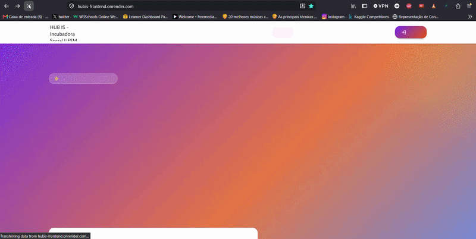

# Projeto: Aplicação com persistência de dados em backend





## Acesso

[Frontend](https://hubis-frontend.onrender.com/
)
[Backend](https://hubis-backend.onrender.com/)

Obs: Necessário inicializar o back entrando na url para mostrar dados no front


## Desenvolvedor(a)
- Miguel Brondani
- Ciência da Computação


## Proposta
 Alteração no Vitrine Hubis: identificar e corrigir ‘flash’ da Logo ao entrar na página. Revisar rotas e validações. Fazer deploy no render, usar PostgreSQL.


## Parceria/cliente/usuário
Carlos Eduardo Velozo

## Feedback/comentário da parceria/cliente/usuário
O resultado da atualização no Vitrine Hubis atende os requisitos. A correção do "flash" branco ao carregar a página deixou a navegação fluida e visualmente agradável. Deploy no Render integrado ao PostgreSQL está rodando bem.

## Desenvolvimento

### Processo

Fazer deploy no render. Havia instruções de como executar o projeto localmente, mas não em plataforma de 3ºs. Já havia feito deploy na plataforma, mas como 'mono repositorio'. Encontrei a solução de 'Blueprint', onde com um arquivo .yaml é possível definir a estrutura dos serviços.

Tive problema com CORS, já que o front e back ficaram em serviços separados. O back recusava toda comunicação do front. Necessário configurar uso de variáveis de ambiente para referenciar as URLs.

O problema do Flash parecia ser o logo inicialmente. Gravei o flash da tela, e observando melhor deu para ver que alguns elementos da página carregavam sem estilo. Descobri a existencia do Flash of Unstyled Content (FOUC).

Observei alguns problemas de imagens, que não eram carregadas corretamente no deploy. Criei pastas no frontend para guardar corretamente o logo, favicon e gif usados.
Tentei corrigir blocos de imagens cujas referências não existiam mais usando o componente já existente ImageWithFallback. Trocando as tags < img > por tal componente a interface fique mais *bonita* (não finalizado).  


### Trechos de código


## Blueprint: render.yaml
```yaml
databases:
  - name: hubis-db
    plan: free

services:
  - type: web
    name: hubis-backend
    runtime: python
    plan: free
    rootDir: backend
    buildCommand: pip install -r requirements.txt && python init_db.py
    startCommand: gunicorn app:app
    envVars:
      - key: PYTHON_VERSION
        value: 3.11.9
      - key: JWT_SECRET
        generateValue: true
      - key: DEBUG
        value: "False"
      - key: DATABASE_URL
        fromDatabase:
          name: hubis-db
          property: connectionString

  - type: web
    name: hubis-frontend
    runtime: static
    rootDir: frontend
    buildCommand: npm install && npm run build
    staticPublishPath: dist
    routes:
      - type: rewrite
        source: /*
        destination: /index.html
```

## CORS
```python
FRONTEND_URL = os.environ.get("FRONTEND_URL")
if FRONTEND_URL and FRONTEND_URL.strip() != "*":
    allowed_origins = [origin.strip() for origin in FRONTEND_URL.split(",") if origin.strip()]
    CORS(app, resources={r"/*": {"origins": allowed_origins}}, supports_credentials=True)
else:
    CORS(app, resources={r"/*": {"origins": "*"}})
```

## PostgreSQL
```python
DATABASE_URL = os.environ.get("DATABASE_URL")
if DATABASE_URL:
    if DATABASE_URL.startswith("postgres://"):
        DATABASE_URL = DATABASE_URL.replace("postgres://", "postgresql://", 1)
    engine = create_engine(DATABASE_URL, echo=False, future=True)
else:
    engine = create_engine(f"sqlite:///{DB_PATH}", echo=False, future=True)
```


## Tecnologias

### Linguagens e afins

Substitua este trecho por uma lista detalhada de tecnologias utilizadas:
- HTML/CSS
- Python
- Flask
- Typescript / React
- Tailwind CSS
- JWT
- Gunicorn

### Ambiente de desenvolvimento

- VSCODE
- Claude
- Gemini
- Firefox devtools

## Referências e créditos

- Material de FOUC: [wikipedia](https://en.wikipedia.org/wiki/Flash_of_unstyled_content) e [youtube](https://www.youtube.com/watch?v=rO1tT_P5_ck&t)
- Claude


---
Projeto entregue para a disciplina de [Desenvolvimento de Software para a Web](http://github.com/andreainfufsm/elc1090-2026b) em 2026b
